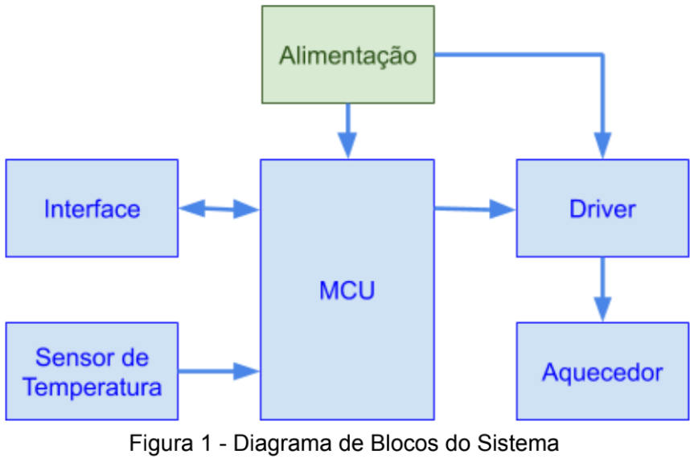

## Controlador de temperatura ON/OFF

* **Descrição geral do Sistema:**

   O sistema de controle de temperatura ON/OFF possui uma interface composta por display 16x2 e 3 botões (LEFT | P | RIGHT). O controle é realizado com histerese (dead band) e a configuração de alguns parâmetros do sistema é feita através da interface de usuário. Sâo elas:
      * Novo set-point.
      * Valor de histerese para ligar o driver.
      * Valor de histerese para desligar o driver.
      * Desabilitar o controlador independentemente da temperatura

   

* **Funcionamento:**

   O sistema se inicializa na tela de supervisório. Nela é possível observar o estado atual do controlador, os valores mínimo e máximo de histerese, o valor atual da temperatura e o setpoint configurado. Ao clicar e segurar o botão P, o sistema entra no modo de configuração. Nesse modo é possível percorrer 3 telas, sendo elas a configuração da porcentagem de histerese, o estado atual da saída para o driver e o setpoint desejado. Para alternar entre as telas, os botões LEFT e RIGHT são utilizados. Para editar alguma configuração de alguma tela, dar um clique simples no botão P e o valor pode ser alterado através das teclas laterais. Para salvar a configuração, clicar no botão P novamente. Para sair do modo de configuração e retornar para a tela supervisória, clicar e segurar novamente no botão P.

* **Periféricos:**
   * **Sensor:** O Sensor de temperatura utilizado é o sensor analógico LM35.
   * **MCU:** O MCU escolhido para o desenvolvimento foi o ATMega328p (Arduino) e ele é o responsável pelas tarefas de controle e interface do sistema. 
   * **Driver:** O driver do controlador é composto um único transistor do tipo MOSFET ligado no componente virtual OVEN do Proteus.

* **Software:**
   * **Bibliotecas utilizadas:** LiquidCrystal
   * **Definições:** O arquivo */include/definitions.h* contém todas as definições de GPIOs, ID das telas da interface, parâmetros iniciais do controlador e a assinatura dos métodos.
   * **Arquivo .hex:** Ao compilar a aplicação, os arquivos .hex e .elf ficam localizados na pasta escondida **.pio/build/uno/**. 

   **OBS: Ao fazer upload para a placa, os arquivos não se encontram mais nessa pasta**

* **Trabalhos Futuros:**
   * Armazenar os parâmetros do sistema na EEPROM para que não seja preciso uma nova configuração à cada inicialização.